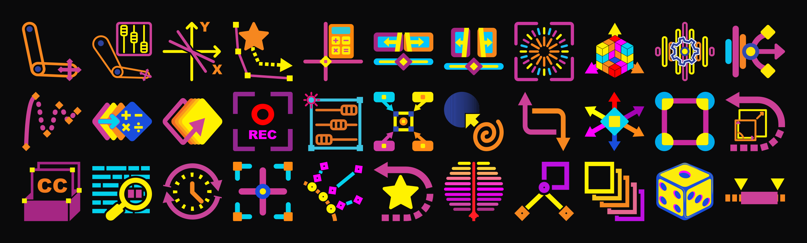

# IVG Toolkit — After Effects Scripts



A catalog of **33 production-ready Adobe After Effects scripts**, a dockable **Build-a-Bar** command bar — as both a ScriptUI panel *and* a native AEGP plugin — a client-side bundle generator, and a full **test harness**, organized as a monorepo.

**Live catalog & docs:** https://forge.mograph.life/apps/ae

## Quick Start

```bash
# Install dependencies
yarn install

# Rebuild the website data (scripts.json + meta.json) from script front matter
node site/tools/build-data.mjs

# Rebuild the toolbar icons + the "download all" bundle (site/download/ae-scripts.zip)
node site/tools/build-bundle.mjs

# Serve the static site locally
npx serve site        # or any static server rooted at ./site

# Run the AE test harness
cd tools/ae-test-harness && yarn test
```

## Repository Structure

```
ae/
├── packages/
│   ├── ae-scripts/
│   │   ├── src/                  # 36 source scripts (33 distributed)
│   │   │   ├── animation/        # Motion and rigging tools
│   │   │   ├── composition/      # Comp layout and slider templates
│   │   │   ├── effects/          # Visual effects, audio sync, color
│   │   │   ├── keyframes/        # Keyframe manipulation and easing
│   │   │   ├── layers/           # Layer utilities and control rigs
│   │   │   ├── paths/            # Shape and path tools
│   │   │   └── utilities/        # General-purpose helpers
│   │   └── toolbar/
│   │       └── Build-a-Bar.jsx   # Dockable ScriptUI panel — one button per script
│   └── cep-extensions/
│       └── frame-navigator/      # React-based CEP extension
├── site/                         # Static website (deployed to forge.mograph.life/apps/ae)
│   ├── index.html                # Catalog + Build-a-Bar bundle generator
│   ├── docs.html                 # Per-script documentation viewer
│   ├── data/                     # Generated scripts.json / meta.json + copy overrides
│   ├── download/                 # Prebuilt downloads
│   │   ├── ae-scripts.zip        #   full ScriptUI bundle (all scripts + the bar)
│   │   └── native/               #   native plugin binaries: mac-silicon, mac-intel, windows-x64
│   └── tools/
│       ├── build-data.mjs        # Front-matter → data + self-contained asset copy
│       └── build-bundle.mjs      # Rasterize toolbar icons + assemble the ScriptUI zip
├── tools/
│   ├── ae-test-harness/          # vitest + static/expression/functional/UI checks
│   ├── scripting-modules/        # Shared ExtendScript libraries
│   ├── bundlers/                 # Build utilities
│   └── templates/                # Project templates
├── vendors/                      # Vendored third-party scripting libraries
└── docs/                         # Documentation (per-script Markdown in docs/scripts/)
```

> The **native Build-a-Bar plugin source** (cross-platform C++/Obj-C++ AEGP, macOS + Windows) is maintained in a separate private repository; only its prebuilt binaries are distributed here, under `site/download/native/`.

## Script Catalog (33)

Three scripts remain in `src/` but are **excluded from distribution** (the bundle, the Command Bar, and the website): `Onionizer`, `PathDuplitron`, and `Split-o-matic_9x16`.

### Animation (4)

| Script | Description |
|--------|-------------|
| **[2-3 IK Rigger](packages/ae-scripts/src/animation/2-3_IK_Rigger.jsx)** | Select 2 or 3 layers and run it — they're wired into a working 2- or 3-segment IK chain. |
| **[PathMaster](packages/ae-scripts/src/animation/PathMaster.jsx)** | Animate a layer's Position along any shape-layer path — retime, re-ease, trim, loop, or ping-pong. |
| **[Linearizer](packages/ae-scripts/src/animation/Linearizer.jsx)** | Drive existing keyframed animation from any slider, position, or rotation value. |
| **[Limb-a-tron](packages/ae-scripts/src/animation/Limb-a-tron.jsx)** | Two-segment IK/FK limb rig — drag one null to bend it, tune everything from one controller. |

### Composition (3)

| Script | Description |
|--------|-------------|
| **[Guiderator](packages/ae-scripts/src/composition/Guiderator.jsx)** | Drop exact ruler guides by typing a number — or a formula like `1920/2` — into a dockable panel. |
| **[Slidotron_16x9](packages/ae-scripts/src/composition/Slidotron_16x9.jsx)** | One-click horizontal 4K slide-reveal rig — two nested comps with mirrored alpha mattes. |
| **[Slidotron_9x16](packages/ae-scripts/src/composition/Slidotron_9x16.jsx)** | One-click vertical 1080×1920 slide-reveal rig with mirrored mattes. |

### Effects (4)

| Script | Description |
|--------|-------------|
| **[ChromaBlenderizer](packages/ae-scripts/src/effects/ChromaBlenderizer.jsx)** | Ramp a color range across selected fills, strokes, and effect colors from a modeless palette. |
| **[sfxMaster](packages/ae-scripts/src/effects/sfxMaster.jsx)** | Mix Voice Over, SFX, and Music from three master sliders — audio layers auto-categorized. |
| **[BurstMate](packages/ae-scripts/src/effects/BurstMate.jsx)** | Drop a fully rigged radial stroke burst — control color, length, density, and decay. |
| **[Sync-o-tron](packages/ae-scripts/src/effects/Sync-o-tron.jsx)** | Make any property audio-reactive in one click — TuneSync builds the Easing/Min/Max controls; ships with a template project that auto-imports. |

### Keyframes (4)

| Script | Description |
|--------|-------------|
| **[Elast-o-matic](packages/ae-scripts/src/keyframes/Elast-o-matic.jsx)** | Add elastic overshoot or gravity bounce after any keyframe — hold Cmd/Ctrl at launch to switch variant. |
| **[KeyBot](packages/ae-scripts/src/keyframes/KeyBot.jsx)** | Batch-edit selected keyframe values with `=`, `+`, `−`, `×`, `÷` per axis. |
| **[KeyCloneMatic](packages/ae-scripts/src/keyframes/KeyCloneMatic.jsx)** | Repeat a hand-tuned keyframe set down the timeline at a fixed or decaying interval. |
| **[Valuatron](packages/ae-scripts/src/keyframes/Valuatron.jsx)** | Stamp a keyframe at the playhead for every selected property at once. |

### Layers (10)

| Script | Description |
|--------|-------------|
| **[Controllerizer](packages/ae-scripts/src/layers/Controllerizer.jsx)** | Gather any selected properties from any layers onto one Controller Null as matching expression controls. |
| **[Opac-o-bot](packages/ae-scripts/src/layers/Opac-o-bot.jsx)** | Parenting for Opacity — selected layers' Opacity follows their parent via expression. |
| **[Reseterator](packages/ae-scripts/src/layers/Reseterator.jsx)** | Zero the transform origin of selected layers — layer anchor to `[0,0,0]` and every nested shape group re-centered. |
| **[NullBot](packages/ae-scripts/src/layers/NullBot.jsx)** | Parent a group of layers to one master null at their average position. |
| **[Parent-o-bot](packages/ae-scripts/src/layers/Parent-o-bot.jsx)** | Blend a layer's Position, Scale, Rotation, and Opacity toward up to two parent layers. |
| **[Rectangulator](packages/ae-scripts/src/layers/Rectangulator.jsx)** | Convert a parametric rectangle into a bezier shape with independent per-corner rounding and a 9-point anchor grid. |
| **[OrderMaster](packages/ae-scripts/src/layers/OrderMaster.jsx)** | Reverse or shuffle the stacking order of a contiguous run of layers or shape groups. |
| **[SubtitleForge](packages/ae-scripts/src/layers/SubtitleForge.jsx)** | Build a full caption rig — text plus a self-sizing box with stroke and drop shadow. |
| **[TextMate](packages/ae-scripts/src/layers/TextMate.jsx)** | Highlight every case-sensitive occurrence of a word in a text layer, each with its own animator. |
| **[TimeWarp-a-tron](packages/ae-scripts/src/layers/TimeWarp-a-tron.jsx)** | Drive a layer's Time Remap from a 0–100 slider that scrubs a user-defined in/out range. |

### Paths (5)

| Script | Description |
|--------|-------------|
| **[Centralizer](packages/ae-scripts/src/paths/Centralizer.jsx)** | Drop center and bounding-box guides around anything — one shape, a multiselected group, images, or precomps. |
| **[VertexMaster](packages/ae-scripts/src/paths/VertexMaster.jsx)** | Turn a bezier path's vertices and tangents into keyframable, parentable null-object handles. |
| **[Distributron](packages/ae-scripts/src/paths/Distributron.jsx)** | Spread a comp's layers evenly along a shape path, each auto-rotating to follow the curve. |
| **[Originator](packages/ae-scripts/src/paths/Originator.jsx)** | Recenter a shape layer's bezier path origin on `(0,0)` so it scales and rotates predictably. |
| **[Trace-o-matic](packages/ae-scripts/src/paths/Trace-o-matic.jsx)** | Convert a layer's masks into a new shape layer with hold-keyframed paths and opacity. |

### Utilities (3)

| Script | Description |
|--------|-------------|
| **[Iteratron](packages/ae-scripts/src/utilities/Iteratron.jsx)** | Spread a property evenly across a layer stack between a start value and an end value. |
| **[RandoMatic](packages/ae-scripts/src/utilities/RandoMatic.jsx)** | Replace every selected keyframe's value with a fresh uniform-random number per axis. |
| **[Triminator](packages/ae-scripts/src/utilities/Triminator.jsx)** | Add a pre-keyframed 0→100% Trim Paths reveal to a shape layer's contents. |

## Build-a-Bar

The **Build-a-Bar** command bar ships in two forms — a universal ScriptUI panel and a native plugin — both a single dockable toolbar with one icon button per bundled script.

### ScriptUI panel

`packages/ae-scripts/toolbar/Build-a-Bar.jsx` is a dockable, resizable ScriptUI panel. It reflows responsively (vertical, horizontal, or grid), reads tooltips from a bundled `tooltips.txt`, auto-discovers scripts from a sibling `ivg-scripts/` folder, and swaps Shift- and Cmd/Ctrl-variant icons live. Install it in the After Effects `ScriptUI Panels` folder so only the Command Bar appears in the `Window` menu; the individual scripts live in the `ivg-scripts/` subfolder and are launched from the bar. Runs in any AE version — no install beyond copying the folder.

### Native plugin

A real native **AEGP plugin** (not a script or CEP extension) that draws the same bar with **crisp vector icons at any size**. On top of the panel it adds a customizable bar where you can **drag to reorder** the tools, **change icon size**, and recolor the icons to **monochrome in any tint**, with an orientation-aware Build-a-Bar logo. Prebuilt binaries for **macOS (Apple Silicon + Intel)** and **Windows (x64)** are offered on the website's Build-a-bar section and stored under `site/download/native/`. The plugin source is maintained in a separate private repository.

## Website & Build-a-bar generator

The `site/` directory is a self-contained static site (vanilla HTML/CSS/JS) deployed to **https://forge.mograph.life/apps/ae**:

- **Catalog** — every distributed script with icon, purpose-first tagline, and a detail view.
- **Docs** — the full per-script documentation, rendered from `docs/scripts/*.md`.
- **Build-a-bar** — check the scripts you want, pick a format (ScriptUI panel, or native macOS / Windows plugin), and download a custom package containing Build-a-Bar plus your chosen scripts, assembled entirely client-side with JSZip.

`site/tools/build-data.mjs` parses each script's JSDoc front matter into `scripts.json` / `meta.json`, applies curated taglines from `copy-overrides.json`, and copies icons, docs, scripts, the toolbar, and the Sync-o-tron template project into `site/` so the site is fully self-contained. `site/tools/build-bundle.mjs` rasterizes the toolbar icons and assembles the download zip.

## Test Harness

`tools/ae-test-harness` runs the scripts through a layered ExtendScript-simulation pipeline (vitest):

- **Static** — ES3 parse via acorn (`ecmaVersion: 3`) plus a scan for malformed `@include` preprocessor directives.
- **Expression** — AE expression syntax validation.
- **Functional** — sandboxed simulation against category fixtures in `tools/ae-test-harness/fixtures/`.
- **UI** — ScriptUI construction capture.

All 33 distributed scripts pass. `Onionizer` is excluded (external `@include` dependency).

## Installation

### Individual scripts
1. Copy the desired `.jsx` from `packages/ae-scripts/src/<category>/` to your After Effects Scripts folder:
   - **macOS**: `/Applications/Adobe After Effects [version]/Scripts`
   - **Windows**: `C:\Program Files\Adobe\Adobe After Effects [version]\Support Files\Scripts`
2. Restart After Effects and run via `File > Scripts > [Script Name]`.

### Build-a-Bar — ScriptUI panel
Place `Build-a-Bar.jsx` in the `ScriptUI Panels` folder and its `ivg-scripts/` subfolder alongside it, then open it from the `Window` menu. The **Build-a-bar** download on the website packages this layout for you.

### Build-a-Bar — native plugin
Download the build for your platform (macOS Apple Silicon / macOS Intel / Windows x64) from the website's Build-a-bar section, drop the extracted `IVGD` folder into the After Effects `Plug-ins` folder (the download's `INSTALL.txt` has the exact path), and restart AE. Build-a-Bar then appears in the `Window` menu.

### CEP Extension (Frame Navigator)
```bash
cd packages/cep-extensions/frame-navigator
yarn install && yarn build
```

## Development

- **Node.js 16+**, **Yarn** (do not use npm), **After Effects CC 2019+**.
- Scripts target **ES3** (no modern JS in `.jsx`); use `$.writeln()` for debug output.
- Each script carries versioned JSDoc front matter (`@version`, `@changelog`) — the build reads this into the site.
- After editing scripts or copy, run `node site/tools/build-data.mjs` (data) and `node site/tools/build-bundle.mjs` (icons + zip) to regenerate.
- See [CLAUDE.md](CLAUDE.md) for development context and constraints.

## Deployment

The `site/` directory is deployed as an independent Vercel project (`ae`, root directory `site/`, production branch `main`). Pushing to `main` auto-deploys. The public URL is surfaced at **forge.mograph.life/apps/ae** via a rewrite in the forge hub, alongside the other apps (lerp, rav, etc.).

## License

MIT License — see individual script headers for specific attribution.

## Credits

Created and maintained by IVG Design.
